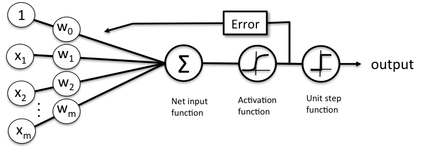

# Why is logistic regression considered a linear model?

The short answer is: Logistic regression is considered a linear model because the outcome **always** depends on the **sum** of the inputs. Or in other words, the output **cannot** depend on the product (or quotient etc.) of the input features!

So, why is that? Let’s recapitulate the basics of logistic regression first, which hopefully makes things more clear. Logistic regression is an algorithm that learns a model for binary classification. A nice side-effect is that it gives us the *probability* that a sample belongs to class 1 (or vice versa: class 0). Our objective function is to minimize the so-called logistic function &Phi; (a certain kind of sigmoid function); it looks like this:

Now, if *&Phi;(z)* is larger than *0.5* (alternatively: if *z* is larger than *0*), we classify an input as class 1 (and class 0, otherwise). This logistic (activation) function doesn't look very linear at all, right!? So, let's dig a bit deeper and take a look at the equation we use to compute *z* -- the net input function!

The net input function is simply the dot product of our input features and the respective model coefficients **w**:

Here, x0 refers to the weight of the bias unit which is always equal to 1 (a detail we don’t have to worry about here). I know, mathematical equations can be a bit "abstract" at times, so let's look at a concrete example.

Let's assume we have a sample training point **x** consisting of 4 features (e.g., *sepal length*, *sepal width*, *petal length*, and *petal width* in the [*Iris dataset*](https://archive.ics.uci.edu/ml/datasets/Iris)):

    x = [1, 2, 3, 4]

Now, let's assume our weight vector looks like this:

    w = [0.5, 0.5, 0.5, 0.5]

Let's compute *z* now!

z = wTx = 1*0.5 + 2*0.5 + 3*0.5 + 4*0.5 = 5

---

Not that it is important, but we have a 99.3% chance that this sample belongs to class 1:

*&Phi;(z=148.41) = 1 / (1 + e-5) = 0.993*

---

The key is that our model is ***additive***
our outcome *z* depends on the additivity of the parameter (times input) values, e.g., :

*z = w1x1 + w2x2*

There's no interaction between input values, nothing like w1x1 * w2x2

 or so, which would make our model non-linear!
